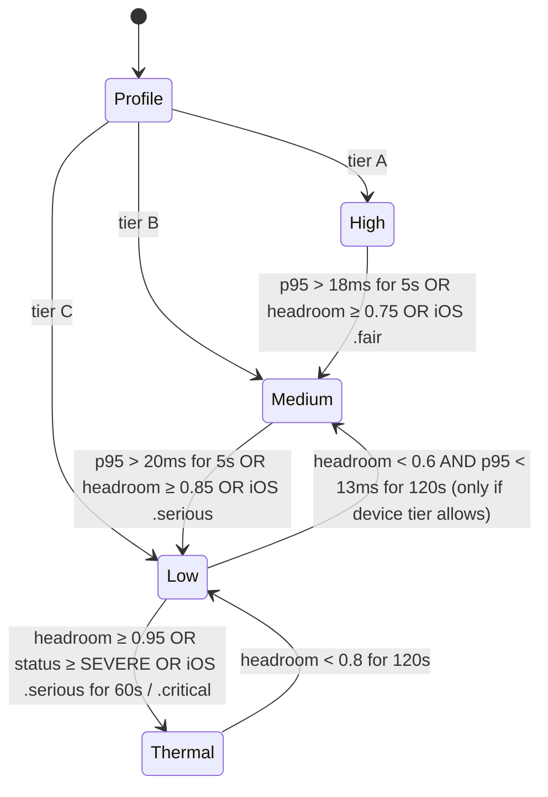

# Vanya: Guardians of the Grove — Project Structure & Engineering Standards (v1.0)

Build Vanya as one monorepo with a node-light Godot 4.7.2 client and a strict 60/30 fps adaptive-quality contract. On the lowest tier, budget ≤ 220 MB RSS, ≤ 8 ms CPU, ≤ 120 draw calls, and at most 1 real Light2D (fake the rest with additive sprites). Enforce these numbers with CI perf gates and a 5-device lab, not by good intentions. The two biggest heat-and-RAM risks in the design are dynamic 2D lights and scene-per-entity swarms. Both have cheap alternatives you should adopt on day one.

## TL;DR
- **Structure:** monorepo `client/ server/ pipelines/ infra/ docs/ tools/`, one-way dependencies `gameplay → core ← presentation(theme)`, ≤ 6 autoloads, data in typed `.tres`, and theme packs as script-free `.pck` files with signed manifests validated in CI.
- **Performance:** Tier C (2–3 GB Android, Mali/PowerVR) runs a 30 fps default, a 60 fps opt-in, and 0.75× render scale. Swarms and projectiles go through pooled "manager + lightweight visuals" (MultiMesh/RenderingServer), not 40 × `CharacterBody2D` + `_process`. Darkness uses CanvasModulate plus additive light sprites, with 0–1 real PointLight2D.
- **Thermal/enforcement:** an `AdaptiveQuality` autoload fed by ADPF `getThermalHeadroom()` (Android 11+) and `ProcessInfo.thermalState` (iOS) steps down a 4-rung ladder. CI runs headless benchmark scenes and fails on regressions. Play Console Android vitals is the production gate. Google's Play Console Help page defines "bad behavior" as "At least 1.09% of daily users experience a user-perceived crash, across all device models" (0.47% for user-perceived ANRs), or 8% on any single device model.

---

## Key Findings (decisions)

| # | Decision | Why |
|---|---|---|
| 1 | **Hybrid entity model**: scene-per-entity for player, bosses, and elite enemies (≤ 8 instances); a data-oriented `SwarmManager` for Rotlings, projectiles, and damage numbers | Per-node `_process` and physics bodies scale linearly. Arrays iterated once per tick are cheaper and allocation-free. |
| 2 | **Lights: CanvasModulate + additive Sprite2D "fake lights"**, with ≤ 1 real `PointLight2D` (player) on Tier B/C and no 2D shadows on Tier C | Godot docs: "Additive sprites are much faster to render, since they don't need to go through a separate rendering pipeline." Also: "Larger lights have a higher performance cost as they affect more pixels on screen."\[1\] |
| 3 | **Textures: pre-rasterized atlases, Lossless** for characters and UI; ETC2 only for large backgrounds after visual review | Godot import docs: Lossless "is the default and most common compression mode for 2D assets". VRAM Compressed "should be avoided for 2D as it exhibits noticeable artifacts".\[2\] |
| 4 | **CPUParticles2D by default** on Tier C; GPUParticles2D allowed on Tier A | Godot docs: CPUParticles2D "may perform better on low-end systems or in GPU-bottlenecked situations".\[3\]\[4\] |
| 5 | **30 fps default on Tier C, 60 on A/B**, and `Engine.max_fps = 30` in menus | `low_processor_mode` "is only read when the project starts", so use `max_fps` for menus.\[5\] |
| 6 | **Theme packs load with `load_resource_pack(path, false)`** into namespaced `res://themes/<id>/` | By default a pack can overwrite earlier files. Pass `false` so a pack never shadows core files.\[6\] |
| 7 | **Crash reporting: Sentry Godot SDK** (GA; Windows/Linux/macOS/iOS/Android; min Godot 4.5) | Official vendor SDK with native crash minidumps.\[7\]\[8\] |
| 8 | **Tests: GdUnit4** (scene runner, mocks, JUnit XML, official GitHub Action) | v6.1.3 lists support for Godot 4.3–4.7.x.\[9\] CI needs `--headless --ignoreHeadlessMode`.\[10\] |

---

## A. Monorepo structure

### A.1 Top-level tree

```
vanya/
├── client/                    # Godot 4.7.2 project (project.godot lives here)
├── server/                    # FastAPI backend + workers + LLM gateway + pcg_py mirror
├── pipelines/                 # asset (SVG→atlas), theme-pack build/sign, AI concept gen
├── shared/                    # SINGLE SOURCE OF TRUTH shared by client+server
│   ├── schemas/               # JSON Schema: arc_plan.v3.json, telemetry/*.json, theme_manifest.v1.json, save.v*.json
│   ├── enums/                 # archetypes.yaml, biomes.yaml, modifiers.yaml → codegen to GDScript + Python
│   └── golden_seeds/          # seed → expected room hash fixtures (PCG parity tests)
├── infra/
│   ├── bicep/                 # ACA, Postgres Flex, Redis, Blob, Front Door, Key Vault
│   ├── docker/                # server, worker, godot-ci images
│   └── github/                # reusable workflow templates
├── docs/  adr/ gdd/ art-bible/ perf/ runbooks/
├── tools/                     # codegen, perf report diff, adb/xcrun helpers, lint_deps.py
├── .github/workflows/
├── .gitattributes  .gitignore  .editorconfig  CODEOWNERS  README.md
└── justfile                   # `just client-test`, `just pack theme=forest`, `just perf`
```

### A.2 Client tree (`client/`)

```
client/
├── project.godot
├── export_presets.cfg              # no secrets (keystore passwords come from env in CI)
├── addons/
│   ├── vanya_core/                 # our own editor tooling (validators, archetype inspector)
│   ├── gdUnit4/                    # test framework (pinned)
│   ├── admob/                      # Poing Studios v5.x (pinned, vendored)
│   ├── godot-iap/                  # hyochan godot-iap (pinned)
│   ├── sentry/                     # sentry-godot (pinned)
│   └── firebase_*/                 # community plugins (pinned, wrapped by services/)
├── autoload/                       # ≤ 6, each < 300 LOC, no gameplay state
│   ├── boot.gd                     # startup order, pack mounting, consent → SDK init
│   ├── event_bus.gd                # typed global signals ONLY for cross-scene events
│   ├── services.gd                 # service locator: ads, iap, analytics, net, save (interfaces)
│   ├── adaptive_quality.gd         # thermal/fps governor → QualityProfile
│   ├── theme_registry.gd           # archetype_id → presentation resource lookup
│   └── scene_router.gd             # threaded loads, transitions, unload
├── core/                           # PURE logic. Depends on nothing below it.
│   ├── archetypes/                 # ArchetypeDef.gd (Resource), ids.gd (generated from shared/enums)
│   ├── combat/                     # damage calc, status effects, hitbox math (no nodes)
│   ├── rng/                        # SeededRng wrapper (PCG32 via RandomNumberGenerator)
│   ├── sim/                        # SwarmSim (struct-of-arrays), ProjectileSim, spatial hash
│   └── util/
├── gameplay/                       # nodes/scenes that USE core; ask theme_registry for visuals
│   ├── player/                     # player.tscn, player.gd, bow_autoaim.gd
│   ├── enemies/                    # thornback.tscn, wisp.tscn, rotheart_boss.tscn (scene-per-entity)
│   ├── swarm/                      # swarm_manager.gd + swarm_renderer.gd (MultiMesh)
│   ├── projectiles/                # projectile_manager.gd (pooled, RenderingServer canvas items)
│   ├── room/                       # room.tscn, wave_director.gd, door/exit logic
│   ├── fx/                         # hitstop.gd, screen_shake.gd, damage_numbers.gd (pooled)
│   └── lighting/                   # darkness.gd (CanvasModulate), fake_light.gd (additive sprite)
├── pcg/                            # chunk_templates/, wfc_lite.gd, poisson.gd, validate.gd, fallback_rooms/
├── dda/                            # skill_rating.gd (Elo), intensity_director.gd, rails.gd
├── ui/                             # screens/, widgets/, hud/, accessibility/
├── services/                       # adapters behind interfaces (mockable)
│   ├── ads/        ads_service.gd (interface), admob_ads.gd, fake_ads.gd
│   ├── iap/        iap_service.gd, godot_iap_store.gd, fake_store.gd
│   ├── analytics/  analytics_service.gd, event_queue.gd, firebase_sink.gd, vanya_sink.gd
│   ├── net/        http_client.gd (retry/backoff/HMAC), director_client.gd
│   ├── save/       save_service.gd, migrations/v1_to_v2.gd …
│   └── platform/   thermal_android.gd, thermal_ios.gd (plugin bridges)
├── data/                           # typed .tres: archetypes/, waves/, loot/, quality/{high,medium,low,thermal}.tres
├── themes/
│   └── grove_default/              # bundled default theme (same layout as downloadable packs)
│       ├── manifest.json  rigs/  tilesets/  ui_theme.tres  fonts/  audio/  strings/  shaders/
├── localization/                   # strings.csv (or .po) → en, hi, mr
├── platform/
│   ├── android/                    # Gradle plugin (ADPF thermal, Game State), build template overrides
│   └── ios/                        # plugin (thermalState, memory warnings)
├── bench/                          # headless benchmark scenes: bench_swarm_40.tscn, bench_boss.tscn
└── tests/
    ├── unit/  (mirror of core/, pcg/, dda/)
    ├── scene/ (GdUnit scene runner: room clear, pause, revive flow)
    └── golden/ (seed → room hash, vs shared/golden_seeds)
```

**Dependency direction (enforced by a CI grep/lint script in `tools/lint_deps.py`):**

```mermaid
graph TD
  core[core/ pure logic] 
  pcg[pcg/] --> core
  dda[dda/] --> core
  gameplay[gameplay/] --> core
  gameplay --> pcg
  gameplay --> dda
  ui[ui/] --> core
  services[services/ interfaces] --> core
  gameplay -. via services.gd interface .-> services
  theme[themes/*  assets only] -. looked up by archetype_id via theme_registry .-> gameplay
  core -. NEVER .-> theme
  core -. NEVER .-> services
```

Rules:
- `core/` must not `preload`/`load` anything under `themes/`, `ui/`, `services/`, or `addons/`.
- Gameplay never references a theme path. It calls `ThemeRegistry.visual_for(&"rotling")`.
- Theme packs contain **no** `.gd`, `.gdc`, `.gdextension`, `.so`, `.dylib`, or `.cs` (App Store 2.5.2). The CI pack validator rejects them.

### A.3 Server tree (`server/`)

```
server/
├── pyproject.toml  uv.lock
├── app/
│   ├── main.py  config.py      # app factory + lifespan; pydantic-settings (12-factor env only)
│   ├── api/v1/                 # director, telemetry, iap, packs, save, health routers
│   ├── domain/                 # pure logic: arc_plans/, dda/, entitlements/, players/
│   ├── adapters/               # db/ (SQLAlchemy 2 async), redis/, blob/, stores/ (Play/App Store APIs)
│   ├── llm_gateway/            # Gemini Flash-Lite → Claude Haiku router, validation, cost caps
│   │   ├── prompts/arc_plan/v3.md
│   │   └── evals/arc_plan/*.jsonl
│   ├── pcg_py/                 # Python mirror of client PCG
│   ├── security/  observability/
├── workers/                    # arq: pool refill, novelty embeddings, rollups, RTDN
├── migrations/                 # Alembic
└── tests/ unit/ api/ contract/ evals/
```

### A.4 Pipelines tree (`pipelines/`)

```
pipelines/
├── asset/        export_svg.py (resvg/Inkscape CLI → PNG @1x/0.75x) · pack_atlas.py (≤2048², 2px pad+extrude) · palette_lut.py · import_presets/
├── theme_pack/   build_pack.sh (godot --headless --export-pack) · validate_pack.py · manifest.py (SHA-256) · sign.py (Ed25519, key in Key Vault)
└── ai_concepts/  offline generation → concept boards only (never shipped raw)
```

### A.5 Naming conventions

| Thing | Convention | Example |
|---|---|---|
| Files/folders | `snake_case` | `wave_director.gd`, `rotheart_boss.tscn`\[11\] |
| `class_name` | `PascalCase` | `class_name WaveDirector`\[11\] |
| Functions/vars | `snake_case`; `_private` prefix | `func _spawn_wave()`\[11\] |
| Signals | past-tense verb | `signal enemy_died(id: int)` |
| Archetype IDs | `StringName`, `snake_case`, immutable once shipped | `&"rotling"`, `&"thornback"` |
| Theme paths | `res://themes/<theme_id>/<category>/<archetype_id>_<part>.<ext>` | `themes/grove_default/rigs/rotling_body.png` |
| Resources | suffix by type | `rotling_def.tres`, `wave_03.tres`, `quality_low.tres` |
| Telemetry events | `object_action` | `room_cleared`, `ad_reward_granted` |

### A.6 Git hygiene

`.gitattributes` (Godot 4 + LFS):
```
* text=auto eol=lf
*.gd text  *.tscn text  *.tres text  *.godot text  *.cfg text  *.import text  *.svg text
*.png filter=lfs diff=lfs merge=lfs -text
*.ogg filter=lfs diff=lfs merge=lfs -text
# same LFS line for: *.wav *.psd *.ttf *.otf *.pck *.aab
```
`.gitignore`:
```
.godot/
client/android/build/        # regenerated by "Install Android Build Template" (commit only overrides)
*.keystore  *.jks  *.p12  *.mobileprovision  export_credentials.cfg
server/.venv/  __pycache__/  .env
out/  dist/
```
- **Branching:** trunk-based on `main`, short-lived `feat/*`, and release tags `v1.4.0`. Hotfixes branch from the tag.
- **Versioning:** SemVer for `version/name` and a monotonic `versionCode = MAJOR*10000 + MINOR*100 + PATCH`. iOS `CFBundleVersion` uses the same integer.
- **Commits:** Conventional Commits (`feat(pcg): …`, `perf(swarm): …`, `fix(iap): …`), and `release-please` generates changelogs.

### A.7 Hybrid entity model (the swarm decision)

```
┌──────────────────────── Room scene ────────────────────────┐
│ Player (scene)   Thornback×N (scene, pooled)   Boss         │
│ SwarmManager (1 node, ticks @ 30 Hz)                        │
│   ├ SoA arrays: pos[], vel[], hp[], state[], archetype[]    │
│   ├ spatial hash (cell = 2 tiles) for separation/hits       │
│   └ SwarmRenderer: MultiMeshInstance2D per archetype        │
│ ProjectileManager (pooled RID canvas items, no Area2D)      │
│ DamageNumberPool (32 recycled)                              │
└─────────────────────────────────────────────────────────────┘
```

- **Rotlings (up to ~30 of the 40):** simulated in `SwarmSim` (packed arrays). Collisions against player and arrows use circle-vs-circle through the spatial hash, not physics bodies. Draw them with a MultiMesh if they are single-quad animated sprites. Cut-out rigs with Bone2D **cannot** be MultiMeshed, so swarm units should use a baked sprite-sheet (flipbook) version of the rig. Rigs stay for hero, elites, and boss.
- **Thornback/Wisp/Boss:** normal scenes with `Area2D` hurtboxes, pooled (pre-instantiated at room load), and ticked by the manager rather than each node's `_process`.
- **Arrows:** `ProjectileManager` moves them in arrays and raycasts or does circle tests against the spatial hash. Visuals are RenderingServer canvas items.
- **Rule:** no enemy uses `_process`. `WaveDirector` calls `tick(delta)` on active entities in order. Set `process_mode = DISABLED` on pooled, inactive nodes and remove them from the tree when parked (Godot docs note that removing nodes from the tree can perform much better than hiding or pausing them).\[12\]

### A.8 Autoload discipline, data, save, localization

- **Autoloads** (≤ 6, listed in A.2) hold services and cross-scene routing only, never mutable gameplay state. Godot's own guidance: use them for broad-scope systems that manage their own information, and prefer `static func`/`static var` for helpers.\[11\]\[13\]\[14\]
- **Signals vs calls:** call down, signal up. Siblings talk via their parent. `EventBus` is reserved for cross-scene events (`run_ended`, `purchase_granted`, `quality_changed`). Always use typed signal params.\[11\]
- **Data-driven:** every tunable lives in a typed `Resource` (`ArchetypeDef`, `WaveDef`, `QualityProfile`). Code has zero magic numbers. Resources are read-only at runtime (`duplicate()` before mutating).
- **Static typing:** turn on `debug/gdscript/warnings/untyped_declaration = Error` (plus `unsafe_*` warnings) in project settings.\[15\] Typed GDScript is faster and catches Claude's mistakes at parse time.\[11\]
- **Save format:** JSON with `{ "schema": 3, "written_at": …, "crc32": …, "data": {…} }`. `migrations/vN_to_vN+1.gd` runs in a chain. Writes are atomic (`save.tmp` → fsync → rename; keep `save.bak`). Cloud save is an opt-in server blob keyed by account, last-writer-wins with a conflict prompt.
- **Localization:** CSV `keys,en,hi,mr` → `.translation`. Themes provide their own strings namespace (`THEME_GROVE_*`). Use Noto Sans Devanagari as a fallback font (HarfBuzz shaping is built into Godot 4's TextServer Advanced; keep it, don't switch to the fallback TextServer).

---

## B. Performance, memory, battery & thermal budgets

### B.1 Device tiers

| Tier | Example devices (India-relevant) | RAM | GPU | Default mode |
|---|---|---|---|---|
| **C (floor)** | Helio G35/G37/G85, Unisoc T606/T612, Snapdragon 4xx/4 Gen 1 | 2–3 GB | Mali-G52/G57, PowerVR GE8320, Adreno 610 | Low @ 30 fps |
| **B (mainstream)** | Helio G88/G99, SD 6-series, Dimensity 6xxx; iPhone XR/11 | 3–4 GB (iOS 3–4 GB) | Mali-G57 MC2, Adreno 6xx, A12/A13 | Medium @ 60 fps (30 on thermal) |
| **A** | SD 7/8-series, iPhone 12+ | 6 GB+ | modern | High @ 60 fps |

Tier detection at first boot: RAM (`OS.get_memory_info()`), GPU renderer string (`RenderingServer.get_video_adapter_name()`), and a 3-second micro-benchmark in the splash scene. Store the result and let the player override it.

### B.2 Budget table (hard limits; CI and device lab enforce)

These are our engineering targets, derived from 16.6/33.3 ms frame budgets and the headroom needed to avoid thermal throttling. They are not vendor-published limits.

| Metric | Tier C (2–3 GB) | Tier B / iPhone XR-11 | Tier A | How measured |
|---|---|---|---|---|
| Target fps (combat) | 30 (60 opt-in) | 60 | 60 | in-game frame timer p50/p95 |
| Frame time p95 | ≤ 33 ms (≤ 16.6 opt-in) | ≤ 16.6 ms | ≤ 16.6 ms | custom monitor + Perfetto |
| CPU main thread / frame | ≤ 8 ms @30 | ≤ 7 ms | ≤ 6 ms | Godot profiler, Perfetto |
| ├ script (GDScript) | ≤ 3 ms | ≤ 2.5 ms | ≤ 2 ms | `Performance.TIME_PROCESS` |
| ├ physics | ≤ 1.5 ms | ≤ 1.5 ms | ≤ 1 ms | `TIME_PHYSICS_PROCESS` |
| └ render submit | ≤ 3 ms | ≤ 3 ms | ≤ 3 ms | Godot visual profiler |
| GPU / frame | ≤ 20 ms @30 | ≤ 12 ms | ≤ 10 ms | AGI / Mali Streamline / Xcode |
| Draw calls (2D) | ≤ 120 | ≤ 200 | ≤ 300 | `RENDER_TOTAL_DRAW_CALLS_IN_FRAME` |
| Overdraw (avg layers/pixel) | ≤ 2.5× | ≤ 3× | ≤ 4× | AGI/Streamline fragment counters |
| Real `PointLight2D` on screen | 0–1, no shadows | ≤ 2, hard shadows off | ≤ 4, 1 shadowed (PCF5 max) | scene lint |
| Fake additive light sprites | ≤ 16 | ≤ 24 | ≤ 32 | scene lint |
| Particles alive | ≤ 150 (CPU) | ≤ 300 | ≤ 600 | custom monitor |
| Physics bodies/areas active | ≤ 40 | ≤ 60 | ≤ 80 | `PHYSICS_2D_ACTIVE_OBJECTS` |
| Physics tick | 30 Hz | 60 Hz (30 on thermal) | 60 Hz | project setting |
| Texture memory (VRAM) | ≤ 96 MB | ≤ 128 MB | ≤ 192 MB | `RENDER_TEXTURE_MEM_USED` |
| Total RSS (in combat) | **≤ 220 MB** | **≤ 300 MB** | ≤ 400 MB | `dumpsys meminfo`, Xcode memory gauge |
| Orphan nodes after 10 room transitions | 0 | 0 | 0 | `OBJECT_ORPHAN_NODE_COUNT` in CI |
| Audio memory | ≤ 12 MB (music streamed OGG; SFX short WAV/OGG) | ≤ 16 MB | ≤ 24 MB | |
| Room generation time (on device, worker thread) | ≤ 150 ms | ≤ 80 ms | ≤ 50 ms | PCG timer |
| Scene load (room) | ≤ 1.5 s | ≤ 1.0 s | ≤ 0.7 s | threaded loader timer |
| Battery drain / 10 min combat | ≤ 3.5% | ≤ 3% | ≤ 2.5% | device lab, screen 50% |
| Skin temp rise / 20 min | no "severe" status; iOS never ≥ `.serious` at Medium | same | same | ADPF / thermalState logs |
| Base download (AAB→APK per device) | ≤ 80 MB | ≤ 80 MB | | Play Console size report |
| IPA (App Store download) | ≤ 120 MB | | | App Store Connect |
| Theme pack download | ≤ 25 MB each | | | pack validator |
| Network wakeups (combat) | 0 (batch at room end/menus) | 0 | 0 | Perfetto radio tracks |

iOS memory: jetsam kills apps without warning, and limits vary by device and state. One Apple Developer Forums report shows a 4 GB iPhone killed at "ActiveHard 2098 MB", so real ceilings on 3 GB XR-class devices are far lower.\[16\]\[17\] Treat 300 MB as safe. Read `os_proc_available_memory()` from the iOS plugin and log it in telemetry.\[18\]

### B.3 Quality settings ladder

| Knob | **High** (Tier A) | **Medium** (Tier B) | **Low** (Tier C) | **Thermal-emergency** |
|---|---|---|---|---|
| `Engine.max_fps` (combat) | 60 | 60 | 30 | 30 (menus 20) |
| Physics ticks/s | 60 | 60 | 30 | 30 |
| Render scale (`content_scale_factor` / SubViewport) | 1.0 | 0.9 | 0.75 | 0.6 |
| Real PointLight2D | player + 3 torches | player + 1 | 0 (player = fake) | 0 |
| 2D shadows | 1 light, PCF5 | off | off | off |
| Fake light sprites | 32 | 24 | 16 | 8 |
| Emissive eyes | shader glow | additive sprite | additive sprite | off (baked color) |
| Particles | GPUParticles2D, 100% | CPUParticles2D, 70% | CPU, 40% | CPU, 20%, no trails |
| Damage numbers | all | all | batched ≥ 3 hits | crits only |
| Screen shake / hit-stop | on | on | on (reduced amplitude) | shake off, hit-stop on |
| Dissolve / rim shaders | on | on | rim off, dissolve → fade | all off → flat modulate |
| Palette-swap LUT | shader | shader | pre-baked variant atlas | pre-baked |
| Swarm anim rate | 30 fps flipbook | 20 | 12 | 8 |
| Max simultaneous enemies (director cap) | 40 | 40 | 32 | 24 (DDA compensates HP) |
| Audio voices | 32 | 24 | 16 | 12 |

**Transitions** (hysteresis so the game never flip-flops):



Step changes only happen at safe moments (between waves or on room transition), except for Thermal, which applies immediately. Emit a `quality_changed` telemetry event on every step.

### B.4 Godot-specific techniques (do these)

**Rendering (Compatibility/GLES3)**
- Keep batches intact: same texture page + same material + no z-index interleaving. Put each archetype's parts in one atlas page. Use **CanvasItem instance shader uniforms** (Godot 4.4 added 2D instance uniforms, which "does not break batching") for per-enemy tint and hit-flash instead of unique materials.\[19\]
- Keep transparent areas small. Godot docs: "It is usually better to use transparent areas as small as possible to minimize these fill rate requirements, especially on mobile, where fill rate is very expensive."\[20\] Trim sprites and use `Polygon2D`/mesh-fit sprites for big soft shapes.
- Darkness: `CanvasModulate` (ambient) + additive `Sprite2D` glow textures parented to torches and player. For the "light mask" look on Tier A only, render light blobs into a low-res (¼) `SubViewport` and multiply it over the scene with one full-screen quad. That's one extra pass, instead of per-light per-item passes.
- 2D lights have a hardcoded per-item light cap. In godot-proposals Discussion #9336 ("Increase 2D Light cap"), a reply explains that "the way 2D light rendering works makes it impossible to expose this as a project setting", and a community tester reports "The 2D light cap is 15, not 16. The cap is per node." Stay far below it anyway.
- Shaders (Mali/PowerVR): `mediump` by default, no dependent texture reads (compute UVs in `vertex()`), no dynamic loops, at most 2 texture samples per fragment, and branch on uniforms only. Run every `.gdshader`'s exported GLSL through the **Mali Offline Compiler** in CI and fail if cycles regress more than 10%.
- Textures: mipmaps **off** for 2D, filter Linear, `Lossless` for rigs and UI.\[21\] Atlas pages ≤ 2048² (Tier C gets a 0.75-density asset variant through the theme manifest). No runtime SVG import. Rasterize in `pipelines/asset` at target density.
- Fonts: one MSDF font per family for scalable UI/damage numbers (cheap at many sizes), with a regular dynamic font only for Devanagari body text if MSDF shaping artifacts appear. Verify on device.

**CPU/GDScript**
- Zero per-frame allocations in hot paths: preallocate `PackedVector2Array`/`PackedFloat32Array`, no `Array.map/filter` or string formatting in ticks, reuse `Dictionary` keys, and use `StringName` for IDs.
- Use a single manager tick instead of per-node `_process`. Set pooled nodes to `process_mode = DISABLED` and park them out of the tree.
- Collision layers/masks: 1 player, 2 player_hurt, 3 enemy, 4 enemy_hurt, 5 player_proj, 6 enemy_proj, 7 walls, 8 pickups. Each Area2D masks only what it needs. `monitorable=false` wherever nothing queries it.
- Physics 30 Hz on Tier C with `physics_interpolation` on (Godot 4.x 2D physics interpolation) so motion still looks smooth at 60 render fps. Verify the setting name in 4.7.
- Threaded loading: `ResourceLoader.load_threaded_request()` for the next room/theme and PCG on `WorkerThreadPool`. On room exit, free the room and drop references so resources refcount to zero. Log `MEMORY_STATIC` before and after in debug builds.
- Leak hunting: `print_orphan_nodes()` in debug after each transition. The CI soak test runs 10 room transitions and asserts `OBJECT_ORPHAN_NODE_COUNT == 0`.

**Frame pacing & power**
- `display/window/vsync/vsync_mode = Enabled`, and use `Engine.max_fps` for 30/60\[15\] (on a 60 Hz panel, 30 means exact every-other-vsync).
- Android Swappy (`display/window/frame_pacing/android/enable_frame_pacing`, default true) came with 4.4.\[19\] The original proposal scoped it to Vulkan, so **verify whether it affects the Compatibility/GLES3 path in 4.7**.\[15\]\[22\] Assume it doesn't and test frame pacing with Perfetto.
- Menus: `Engine.max_fps = 30` (20 on idle screens) and no animated backgrounds when idle for 30 s. `low_processor_mode` is read only at startup, so don't rely on toggling it.\[5\]
- Backgrounding: on `NOTIFICATION_APPLICATION_PAUSED`/`FOCUS_OUT`, pause the tree, stop audio, flush the save, and stop network.
- `display/window/energy_saving/keep_screen_on` defaults to true.\[15\] Keep it for combat, but add an idle timeout that releases it after 2 min on menus. No other wake locks.
- iOS: `display/window/ios/allow_high_refresh_rate = true` is the default.\[15\] Cap to 60 on ProMotion devices (we never need 120).
- Network: batch telemetry at room end or in menus, one request per batch. No polling. Prefetch director plans while on Wi-Fi or at run start.

### B.5 Thermal & battery integration

| Platform | API | Bridge | Poll/listen | Maps to |
|---|---|---|---|---|
| Android 11+ (API 30) | `PowerManager.getThermalHeadroom(forecastSeconds)`, `getCurrentThermalStatus()`, `OnThermalStatusChangedListener` | Godot Android plugin (Kotlin, v2 plugin via `EditorExportPlugin` + AAR) → signal `thermal_changed(headroom, status)` | headroom every 10 s (calling more often returns stale/NaN per Android guidance); listener for status | ladder transitions |
| Android 13+ | `GameManager.setGameState()` (loading/gameplay/UI) & `getGameMode()` (battery vs performance) | same plugin | at scene transitions | if Game Mode = battery → force Low @30 |
| iOS | `ProcessInfo.thermalState` + `thermalStateDidChangeNotification`; `isLowPowerModeEnabled`; memory warnings | iOS plugin (Swift/ObjC++ `.xcframework`) | notification-driven | `.fair`→step down, `.serious`→Low, `.critical`→Thermal |

Android guidance: a headroom value of 1.0 means the device is at the severe-throttling threshold. If `getThermalHeadroom()` returns > 1.0, "reduce workload immediately".\[23\] Apple's guidance for the elevated state is to "Reduce CPU usage. Reduce GPU usage. Reduce I/O. Reduce frame rates."\[24\]

### B.6 Measurement & enforcement

| Tool | Use it for | When |
|---|---|---|
| Godot Profiler + Monitors (+ custom monitors: swarm_count, particles_alive, fake_lights, quality_rung) | script/physics/render split | every feature |
| **Perfetto** | frame pacing, CPU freq, throttling, wakeups | weekly |
| **AGI** / **Arm Performance Studio** (Streamline + Mali Offline Compiler) / Snapdragon Profiler | GPU counters, overdraw, shader cycles | per milestone / shader change |
| `dumpsys meminfo`, `dumpsys batterystats` | RSS/PSS, battery | per release |
| **Xcode Instruments** (Allocations, Leaks, Time Profiler, Energy Log; Metal System Trace only if the iOS Compatibility driver runs over ANGLE/Metal) | iOS memory/CPU/energy | per release |
| Own telemetry (`frame_p95`, `quality_rung`, `thermal_status`) + Firebase Performance | field data by device model | continuous |
| **Play Console Android vitals** | Play Console Help "bad behavior" thresholds: user-perceived crash ≥ 1.09% / ANR ≥ 0.47% of daily users overall, or ≥ 8% per device model; stay under all of them | release gate |

**Device lab (≈ ₹45–60k total):** 1 × Helio G35/G37 (2 GB, PowerVR GE8320), 1 × Unisoc T606/T612 (3 GB, Mali-G57), 1 × Snapdragon 4 Gen 1/680 (Adreno), 1 × Helio G99 (Tier B), 1 × used iPhone XR or 11 (A12/A13, 3–4 GB). Supplement with Firebase Test Lab robo/game-loop runs on real devices.

**CI perf gate:**
```mermaid
flowchart LR
  PR --> unit[GdUnit4 unit+scene] --> golden[PCG golden seeds client+py]
  golden --> bench[headless bench: bench_swarm_40, bench_boss<br/>CPU ms/frame, allocs, orphans, gen time]
  bench --> cmp{> 10% regress vs main baseline?}
  cmp -- yes --> fail[fail PR + comment diff]
  cmp -- no --> nightly[nightly: export AAB → Firebase Test Lab game-loop<br/>on 3 low-end models → frame p95, RSS]
  nightly --> dash[perf dashboard (Postgres + Grafana/Metabase)]
```
Headless runs use `--headless` (dummy renderer), so they measure **CPU/script/physics/memory only**. GPU budgets are enforced by nightly on-device runs and the manual device-lab checklist.\[25\]

---

## C. Standard practices checklists

### C1. Godot 4 architecture & GDScript
Do:
- [ ] Follow the official GDScript style guide (code order: signals → enums → consts → @export → vars → @onready → `_init`/`_ready` → public → private).\[11\]
- [ ] Type everything (`var hp: int`, `-> void`) and make untyped declarations an error.\[11\]
- [ ] Make each scene runnable alone (F6): dependencies injected via `@export` or `setup()`, not `get_node("/root/...")`.
- [ ] Use `%UniqueName` for internal node refs.\[26\] Parents wire children; children emit signals.\[11\]
- [ ] Put data in custom `Resource` classes and behaviour in nodes. Use `RefCounted` or plain classes for non-visual logic (Godot "avoid using nodes for everything").\[27\]
Don't:
- [ ] Put gameplay state in autoloads, or add a 7th autoload without an ADR.\[11\]\[26\]
- [ ] Use `$"../../Something"` paths across scene boundaries.\[11\]
- [ ] Use `await` in hot loops or create a `Tween` per enemy per frame.

### C2. Mobile 2D performance
Do: batch-friendly atlases, instance uniforms, pooled everything, manager ticks, 30 Hz physics on Tier C, additive fake lights, CPU particles on low end, small transparent areas, and profiling on the device lab every week ("test early and test often on all your platforms, especially mobile" — Godot docs).\[28\]
Don't: per-enemy `_process`, `PointLight2D` per torch on Tier C, 2D shadows on low end, full-screen post shaders, runtime SVG, `VRAM Compressed` UI, mipmaps on 2D, `queue_free()`/`instantiate()` during waves.

### C3. Asset pipeline, theme packs, CDN
Do:
- [ ] SVG is the source of truth, with layer names = rig part names (`rotling/body`). `resvg` exports at 1.0× and 0.75×.
- [ ] Atlas per archetype with 2 px padding + extrude. Commit import presets; CI asserts import flags (mipmaps off, Lossless).
- [ ] Manifest: `{theme_id, pack_version, schema_version, min_client, max_client, files[{path, sha256, bytes}], archetypes_covered[], signature(Ed25519)}`.
- [ ] Validator: rejects scripts/native libs, paths outside `res://themes/<id>/`, missing archetype visuals, or over-budget size. It also test-loads every resource headlessly.
- [ ] Download: HTTPS from Front Door with Range resume, verify SHA-256 and signature **before** `load_resource_pack(path, false)`, and mount only at scene boundaries.
- [ ] Cache: `user://packs/`, LRU, ≤ 2 non-default packs, check free space (2× pack size), always keep the bundled default.
Don't: ship AI-generated raster directly, let packs overwrite core paths, mount a pack mid-combat, or trust the CDN without verifying the signature.

### C4. PCG
Do:
- [ ] Use one `SeededRng` (PCG32) per subsystem stream (`layout`, `scatter`, `waves`) derived from `run_seed ^ hash(room_index, stream)`. Never call global `randi()`.
- [ ] Integer or fixed-point math in the generator (float divergence across GDScript and Python is a parity risk). Share golden seeds in `shared/golden_seeds` and compare room hashes in both test suites.
- [ ] Validate every room: flood-fill reachability, A* from entry to exit, a minimum spawn distance from the player, and no enclosed props. Retry up to 3 times, then use a hand-authored fallback room.
- [ ] Generate on `WorkerThreadPool` during the room-exit transition (budget in B.2). The main thread only instantiates.
- [ ] Property-based tests (Hypothesis in Python against `pcg_py`): 10k seeds, with invariants reachable, bounded, and deterministic.
Don't: touch nodes or the SceneTree from the worker thread, or make generation depend on frame timing.

### C5. DDA / player modeling
Do: bound adjustments (enemy HP/damage ±15% max per run, never mid-wave spikes), keep the Elo skill rating server-mirrored for analytics only, respect the intensity director's relax phases (guaranteed ≥ 10 s low-intensity after peaks), log `dda_adjustment` events, A/B test via Remote Config with pre-registered metrics (D1/D7 retention, clear rate, session length), and offer an explicit difficulty option that overrides DDA.
Don't: tie DDA to spending (a trust and regulatory risk), hide pay-to-win behind DDA, or collect more than aggregate performance features.

### C6. LLM / AI integration
Do:
- [ ] The LLM picks **only** from enumerations (`shared/enums`). Use provider structured-output/JSON-schema modes, then **re-validate server-side** with Pydantic + JSON Schema, then run `pcg_py` validation of the plan.
- [ ] Version prompts (`prompts/arc_plan/v3.md`) and store `prompt_version`, `model`, `schema_version` with every plan.
- [ ] Eval set (≥ 200 cases) run in CI on prompt or model change: schema-valid rate ≥ 99.5%, novelty score, difficulty-curve adherence.
- [ ] Pre-generate a pool (per biome × difficulty band) and pick at serve time. pgvector novelty (cosine distance to the player's last N plans). The client prefetches 2 plans. Offline, it uses the deterministic seed-based director.
- [ ] Cost caps: daily token budget per environment in the gateway, per-player rate limit, circuit breaker → fallback to pool/deterministic.
- [ ] Observability: OpenTelemetry GenAI spans → Langfuse (self-host or cloud) + Azure Monitor. Track latency, tokens, cost, and validation failures.
- [ ] Data minimization: send only aggregate skill features, never IDs or free text.
- [ ] Google Play AI-Generated Content policy: apps that generate content with AI "must contain in-app user reporting or flagging features".\[29\] Add a "Report this level" button on the run summary, even though outputs are enumerated.
Don't: let the model emit free text shown to players (if it names arcs, filter them through a moderation pass or a curated name list), call the LLM from the client, or block gameplay on the LLM.

### C7. Ads & IAP
Ads (Poing Studios AdMob v5.0.0, released 2026-07-22, which moved to the Google Mobile Ads Next-Gen SDK on Android; the asset store lists min Godot 4.5):\[30\]\[31\]
- [ ] Order: UMP consent → (iOS) ATT prompt only after UMP and a pre-prompt explainer → `MobileAds.initialize()` → preload 1 rewarded + 1 interstitial.
- [ ] Preload the next ad immediately after show. Never load on the frame you need it. Load on menus, not mid-combat.
- [ ] Interstitial pacing: only at natural breaks (run end), ≥ 3 min apart, never in the first session's first 2 runs, never right after a rewarded ad, max ~4/session (Remote Config).
- [ ] Rewarded ads: grant only on the reward callback, server-log grants, and apply idempotently.
- [ ] Use AdMob test ad unit IDs and registered test devices in all non-prod builds (CI asserts prod IDs only exist in release config).
- [ ] Mediation: add adapters one at a time, pin versions, re-test the 16 KB page-size alignment of every native `.so` (Play requirement for API 35+ targets), and check the Play SDK Index.\[32\]
Don't: show ads during gameplay, put ad buttons near attack controls, or ship without the Play Data safety/iOS privacy manifest entries for the AdMob SDK.

IAP (godot-iap: StoreKit 2 on iOS 15+, Play Billing 8+ per docs; one third-party index says the Android module wraps Billing 7.1.1, so **verify the bundled Billing version before targeting Play's Billing 8 requirement**):\[33\]\[34\]
- [ ] Client purchase → send token/JWS to `/v1/iap/verify` → server validates with the Play Developer API or App Store Server API → grants entitlement → **server acknowledges/consumes**. Google: "If you don't acknowledge a purchase within three days, the user automatically receives a refund, and Google Play revokes the purchase."\[35\]
- [ ] Set `obfuscatedAccountId` to a hashed player ID. Subscribe to Play RTDN and App Store Server Notifications v2 for refunds and revocations.
- [ ] StoreKit 2: start the `Transaction.updates` listener at app launch (through the plugin) and `finish()` only after the server grants. Provide a "Restore Purchases" button (required on iOS).
- [ ] Handle pending purchases (UPI/cash flows are common in India): don't grant until PURCHASED.\[36\]
Don't: trust client-side receipts, or grant twice (idempotency key = purchase token / transaction ID).

### C8. Analytics / telemetry
Do: taxonomy `object_action` with typed params in `shared/schemas/telemetry/*.json` (with a `schema_version`), a ≤ 40-event core set, offline queue in `user://telemetry.jsonl` (cap 1 MB, drop oldest), batching (≤ 1 POST per room end, gzip), HMAC-SHA256 signing with a per-install key issued at registration, sampling for high-volume events (`frame_stats` at 10%), consent gating (no Firebase Analytics / ad personalization until UMP consent; own telemetry limited to strictly necessary without consent), and a random install ID only.
Don't: send advertising ID, device name, email, or IP-derived location to your own backend, or send events per frame.

### C9. Networking & offline-first
Do: timeouts (connect 5 s, total 10 s), retries with exponential backoff and full jitter (base 1 s, cap 60 s, max 5), idempotency keys on every POST, HMAC request signing + timestamp (±5 min replay window), TLS 1.2+ only, no certificate pinning at launch (the operational risk outweighs the benefit for this threat model; revisit if fraud appears), and a game that is fully playable offline with the deterministic director.
Don't: block the UI on network, poll, or retry non-idempotent calls without keys.

### C10. Save system
Do: atomic write (tmp → rename), `.bak` rotation, CRC check on load → fall back to `.bak` → fall back to a fresh save with a telemetry event, versioned migrations with unit tests per version (fixtures of every historical schema), a save on every room clear and on app pause, and cloud save as an opt-in with account linking.
Don't: save with `store_var` of objects (fragile; `allow_objects` is a security risk), or save mid-physics frame.

### C11. Backend (FastAPI)
Do:
- [ ] Layered layout (A.3), `pydantic-settings` config, Pydantic v2 models, SQLAlchemy 2.x async + asyncpg, Alembic migrations reviewed in PR.
- [ ] Telemetry table partitioned by day (native Postgres partitioning; drop partitions after 90 days; rollups kept).
- [ ] Redis for plan pools, rate limiting (token bucket per install/IP), and idempotency keys (24 h TTL).
- [ ] OpenTelemetry (FastAPI + SQLAlchemy + httpx instrumentation) → Azure Monitor. Structured JSON logs with request IDs.
- [ ] OWASP API Top 10: object-level auth on every `/players/{id}`, schema validation on all inputs, request body limits, and rate limits.
- [ ] Secrets in Key Vault via managed identity. No secrets in env files in the repo.
- [ ] Cost: ACA scale-to-zero for workers, a Postgres Flexible Burstable tier at launch, budget alerts at 50/80/100%, and an LLM cap in the gateway.
Don't: run sync DB calls in async routes, or run migrations automatically on app start in prod (run them as a release job).

### C12. CI/CD (GitHub Actions)
Do:
- [ ] Pin the Godot version in one place (`.godot-version` = `4.7.2-stable`) and cache the editor + export templates.
- [ ] Jobs: `lint` (gdlint, ruff, mypy, dependency rules) → `test-client` (gdUnit4-action; `--headless --ignoreHeadlessMode` for non-UI scene tests) → `test-server` (pytest + testcontainers) → `pcg-parity` → `perf-bench` → `export-android` (AAB; keystore from secrets → temp file, deleted after) → `export-ios` (self-hosted M4 Pro: Xcode project → `xcodebuild archive` → fastlane `pilot`).\[10\]\[37\]
- [ ] Android: fastlane `supply` to internal → closed → production with staged rollout 5% → 20% → 50% → 100%, halting if vitals exceed thresholds.
- [ ] Target API 36. Play Console Help (answer 11926878) says: "Starting August 31, 2026: New apps and app updates must target Android 16 (API level 36) or higher", with an optional extension "to November 1, 2026". Verify 16 KB alignment of all `.so` with `zipalign -c -P 16` / APK Analyzer.
- [ ] Theme packs: separate workflow → build → validate → sign → upload to Blob (immutable versioned path) → purge Front Door.
Don't: commit keystores or `.p12`, or produce release builds from a dev machine except iOS signing on the Mac (documented in a runbook).

### C13. Testing & QA
Do: GdUnit4 unit tests for all `core/`, `pcg/`, `dda/` (≥ 80% of public functions), scene tests for room clear / revive / purchase flows with fake services, golden-seed PCG parity, balance simulations (headless 1,000 simulated runs with a bot policy → clear-rate distribution per wave), a device-matrix smoke checklist per release, Firebase Test Lab game-loop runs, and Sentry for crashes/errors (Godot SDK now GA on iOS/Android; note "Metrics are currently not supported on Apple platforms").\[7\]\[8\]\[38\] Upload debug symbols in CI.
Don't: rely on the editor run as QA, or skip testing on the Tier C device.

### C14. Security & privacy
Do:
- [ ] India DPDP Act + GDPR: data inventory in `docs/privacy/data-map.md`, a purpose per field, a retention schedule, an in-app "delete my data" (server deletion job ≤ 30 days), and a privacy notice in English + Hindi.
- [ ] Age gate / neutral age screen at first run. Under-18 users (DPDP treats under 18 as a child) → no personalized ads (`tag_for_under_age_of_consent`), no behavioural telemetry beyond the essentials. Get Play "Families" policy positioning right in the target audience declaration.
- [ ] Keys: no private keys in the client. The HMAC install key is issued by the server and stored in `user://` (accept extractability; rotate on abuse). The theme signing key lives only in Key Vault.
- [ ] Godot PCK encryption (AES-256 via a custom-built template) only raises the bar. The key is inside the binary, so treat all client assets as public.
- [ ] Proportional anti-cheat: server-side sanity checks on submitted scores/economy (time-to-clear lower bounds, currency deltas) and optionally Play Integrity for IAP/leaderboards only.
Don't: ship a leaderboard without server validation, or log PII in Sentry (scrub `user.email`, IPs).

### C15. Accessibility, UX, localization
Do: touch targets ≥ 48 dp (Android) / 44 pt (iOS), a floating joystick with left-hand/right-hand swap, a color-blind-safe palette (never encode enemy type by hue alone; add silhouette + icon), toggles for screen shake, flashing/hit-flash intensity, damage numbers, and haptics (default on, light), captions for important audio cues, text scaling 100–150%, and pause on focus loss.
Localization: Devanagari needs **TextServer Advanced** (HarfBuzz, the default) plus a Noto Sans Devanagari fallback in the UI `Theme`. Test conjuncts/matras in Hindi and Marathi on device. Avoid all-caps transforms, leave 30% text expansion room, and use pseudo-localization builds in QA.
Don't: bake text into textures, or use MSDF for complex-script body text without visual verification.

### C16. Documentation & process
Do: an ADR for every irreversible decision (template: context → decision → consequences → perf impact), a GDD per feature before code, and runbooks for release, rollback, LLM outage, key rotation, and pack revocation.
**Code review checklist for Claude-generated code:**
- [ ] Types on every declaration; no `Variant` leaks in hot paths.
- [ ] No allocations in `_process`/`_physics_process`/`tick`.
- [ ] No new autoload, no `/root/` paths, no reverse dependency (core → theme/services).
- [ ] Uses pooled objects; no `instantiate()`/`queue_free()` during waves.
- [ ] Signals disconnected / nodes freed (no orphans); `await` targets can't outlive their owner.\[11\]
- [ ] API calls exist in **Godot 4.7** (Claude often emits Godot 3 APIs: `yield`, `KinematicBody2D`, `export var` — reject them).
- [ ] Tests added; bench numbers attached for perf-sensitive PRs.
- [ ] Server: Pydantic models at boundaries, async all the way, idempotency on writes, no secrets.

---

## D. Deliverables

### D.1 Definition of Done (per feature)

- [ ] Spec/GDD section updated; ADR if architecture changed
- [ ] Code typed, linted (gdlint/ruff), dependency-rule check green
- [ ] Unit tests + (if UI/flow) scene test; golden seeds unchanged or intentionally updated
- [ ] Headless bench: no > 10% regression in CPU ms, 0 new orphans, no per-frame allocations
- [ ] Ran 10 min on the **Tier C** device: p95 within budget, RSS ≤ 220 MB, no thermal step beyond Low
- [ ] Ran on the iPhone XR/11: no memory warning, thermalState ≤ `.fair` at Medium
- [ ] Quality ladder: feature has behaviour defined for all 4 rungs
- [ ] Theme-agnostic: uses archetype IDs; works with the default theme + a "debug magenta" test pack
- [ ] Telemetry events added to schema with version bump; consent gating respected
- [ ] Localized strings (en/hi/mr keys), accessibility toggles honoured
- [ ] Offline behaviour defined and tested
- [ ] Sentry breadcrumbs for new failure paths; no PII

### D.2 First 4-week setup plan

| Week | Client | Server/Infra | Pipelines/Process | Exit criteria |
|---|---|---|---|---|
| **1 — Skeleton & rules** | Monorepo + Godot 4.7.2 project (Compatibility, portrait, typed warnings as errors), folder tree, 6 autoload stubs, fake service adapters, GdUnit4, blank room | FastAPI `/health`, pydantic-settings, Docker, Alembic; Bicep for RG + Key Vault + Blob | LFS, `.gitignore`, Conventional Commits, CODEOWNERS, ADR-0001..0008; CI lint + unit tests | CI green; `just client-test` works |
| **2 — Performance spine** | `SwarmManager` + MultiMesh (40 quads), `ProjectileManager`, pools, fake-light darkness, `AdaptiveQuality` + 4 profiles, custom monitors, `bench_swarm_40` | Postgres Flex + Redis; telemetry endpoint (HMAC, batch) + partitioned table | Buy device lab; baseline into `docs/perf/`; CI `perf-bench` with baseline JSON | Tier C: 30 fps p95 ≤ 33 ms with 40 enemies + 60 arrows; RSS ≤ 220 MB |
| **3 — Bridges & pipelines** | Android ADPF + Game State plugin; iOS thermalState/memory plugin; ladder wired; save service; PCG v0 on WorkerThreadPool + fallback | `pcg_py` + golden-seed parity; `/v1/director/plan` deterministic (no LLM yet) | SVG → resvg → atlas for Rotling end-to-end; pack build + validator + Ed25519 signing | Golden seeds match; ladder observed stepping on device |
| **4 — Services & release path** | Sentry; AdMob v5 (UMP → ATT, test IDs); godot-iap sandbox; analytics queue; hi/mr CSV + Devanagari fallback | IAP verify + acknowledge + RTDN; LLM gateway (schema validation, pool, cost cap, Langfuse); eval set v0 | fastlane: Play internal + TestFlight; nightly Test Lab; release/rollback runbooks | Signed AAB on internal track; TestFlight build installable |

---

## Caveats & items to verify for Godot 4.7

- **iOS Compatibility driver:** we could not confirm from 4.7 docs whether `rendering/gl_compatibility/driver.ios` defaults to native OpenGL ES or ANGLE-over-Metal. Godot's "Maintenance release: Godot 4.2.1" post (Dec 12, 2023, change GH-85785) reverted macOS to native GL: "It turns out that ANGLE's Metal backend brings more issues than it solves, so we rolled back that change of default backend." Check the ProjectSettings page and test on the XR before choosing Instruments workflows. Apple deprecated OpenGL ES in iOS 12. It still runs, but it's a long-term risk;\[39\] record an ADR with a revisit trigger.
- **Swappy frame pacing** may apply only to Vulkan paths, so don't count on it for GLES3 on Android.\[22\]
- **VRAM compression guidance for 2D** is under active discussion (a 2026 Godot proposal argues to revise the "avoid for 2D" advice).\[40\] Re-evaluate ETC2/ASTC for large backgrounds if RAM is tight.
- **Setting names to verify in 4.7.2:** 2D physics interpolation, `rendering/textures/vram_compression/import_etc2_astc`, and the 2D per-item light cap (community-reported ~15, hardcoded).\[41\]
- **godot-iap's bundled Play Billing version** is reported inconsistently (8+ in docs, 7.1.1 in a third-party index).\[33\]\[34\] Confirm before submission.
- **16 KB page size is already in force.** The Android Developers Blog (May 2025) said: "Starting November 1st, 2025, all new apps and updates to existing apps submitted to Google Play and targeting Android 15+ devices must support 16 KB page sizes." Play Console's technical quality requirements page (announced Aug 26, 2026) lists it too: "Apps that contain native code must support devices with 16 KB memory page sizes." Secondary sources quote later enforcement dates, but treat it as mandatory now and verify every native `.so`.
- **Budgets in B.2 are engineering targets, not platform limits.** Recalibrate after Week 2's device-lab baseline. If Tier C can't hold 30 fps with 40 enemies, lower the director cap (32) before cutting visual identity.

## Sources

1. [2D lights and shadows — Godot Engine (stable) documentation in English](https://docs.godotengine.org/en/stable/tutorials/2d/2d_lights_and_shadows.html)
2. [godot-docs/tutorials/assets\_pipeline/importing\_images.rst at master · godotengine/godot-docs](https://github.com/godotengine/godot-docs/blob/master/tutorials/assets_pipeline/importing_images.rst)
3. [2D particle systems](https://trinovantes.github.io/godot-docs/tutorials/2d/particle_systems_2d.html)
4. [2D particle systems — Godot Engine (stable) documentation in English](https://docs.godotengine.org/en/stable/tutorials/2d/particle_systems_2d.html)
5. [ProjectSettings — Godot Engine (latest) documentation in English](https://docs.godotengine.org/en/latest/classes/class_projectsettings.html)
6. [Exporting packs, patches, and mods — Godot Engine (stable) documentation in English](https://docs.godotengine.org/en/stable/tutorials/export/exporting_pcks.html)
7. [sentry-godot/CHANGELOG.md at main · getsentry/sentry-godot](https://github.com/getsentry/sentry-godot/blob/main/CHANGELOG.md)
8. [Back to Blog Home](https://blog.sentry.io/introducing-logs-user-feedback-godot-sdk)
9. [GdUnit4: Godot 4 Unit Testing Framework](https://dev.co/testing/open-source/gdunit4)
10. [GdUnit4 V4.1.0 feedback · godot-gdunit-labs/gdUnit4 · Discussion #157](https://github.com/godot-gdunit-labs/gdUnit4/discussions/157)
11. [Write code, don't die](https://ash-k.itch.io/tutorials/devlog/334550/write-code-dont-die)
12. [CPU optimization — Godot Engine (3.3) documentation in English](https://docs.godotengine.org/en/3.3/tutorials/optimization/cpu_optimization.html)
13. [Autoloads versus internal nodes — Godot Engine (3.1) documentation in English](https://docs.godotengine.org/en/3.1/getting_started/workflow/best_practices/autoloads_versus_internal_nodes.html)
14. [Autoloads versus regular nodes — Godot Engine (stable) documentation in English](https://docs.godotengine.org/en/stable/tutorials/best_practices/autoloads_versus_regular_nodes.html)
15. [ProjectSettings](https://docs.godotengine.org/en/stable/classes/class_projectsettings.html)
16. [Memory Efficiency in iOS: Reducing footprint and beyond](https://antongubarenko.substack.com/p/memory-efficiency-in-ios-reducing)
17. [jetsam per-process-limit: New iPhones with 4GB RAM suffer memory crash, iPhone 7 does not](https://developer.apple.com/forums/thread/688973)
18. [Two Entitlements to Boost Memory Allocation for iOS Apps](https://zenn.dev/mtfum/articles/ios_memory_entitlements?locale=en)
19. [Godot 4.4, a unified experience](https://godotengine.org/releases/4.4/)
20. [GPU optimization — Godot Engine (stable) documentation in English](https://docs.godotengine.org/en/stable/tutorials/performance/gpu_optimization.html)
21. [How to Fix Godot Textures Using VRAM Compression When Lossless Is Needed](https://bugnet.io/blog/how-to-fix-godot-textures-using-vram-compression-when-lossless-needed)
22. [Integrating Frame Pacing Library to Vulkan Renderer for Android · Issue #2351 · godotengine/godot-proposals](https://github.com/godotengine/godot-proposals/issues/2351)
23. [Thermal API](https://developer.android.com/games/optimize/adpf/thermal)
24. [Documentation Archive](https://developer.apple.com/library/mac/documentation/Performance/Conceptual/power_efficiency_guidelines_osx/RespondToThermalStateChanges.html)
25. [Running in Linux CI · godot-gdunit-labs/gdUnit4Net · Discussion #350](https://github.com/godot-gdunit-labs/gdUnit4Net/discussions/350)
26. [godot architecture organization advice](https://github.com/abmarnie/godot-architecture-organization-advice)
27. [Best practices — Godot Engine (4.0) documentation in English](https://docs.godotengine.org/en/4.0/tutorials/best_practices/index.html)
28. [GPU optimization](https://trinovantes.github.io/godot-docs/tutorials/performance/gpu_optimization.html)
29. [Developer Program Policy - Play Console Help](https://support.google.com/googleplay/android-developer/answer/17190352?hl=en)
30. [Releases · poingstudios/godot-admob-plugin](https://github.com/Poing-Studios/godot-admob-editor/releases)
31. [AdMob - Godot Asset Store](https://store.godotengine.org/asset/poingstudios/admob/)
32. [Target API Level 36 (Android 16) - August 31, 2026 Deadline: Submission and Availability Requirements](https://kapps.store/faq/target-api-level-36-android-16-august-31-2026-deadline-submission-and-availabili.html)
33. [godot-iap](https://hyochan.github.io/godot-iap/)
34. [hyochan/godot-iap](https://deepwiki.com/hyochan/godot-iap)
35. [One-time purchase lifecycle](https://developer.android.com/google/play/billing/lifecycle/one-time)
36. [A Complete Guide to Google Play In-App Purchases and Subscriptions Implementation](https://qonversion.io/blog/a-complete-guide-to-google-play-in-app-purchases-and-subscriptions-implementation)
37. [gdUnit4 action](https://github.com/MikeSchulze/gdUnit4-action)
38. [godot-gdunit-labs/gdUnit4](https://deepwiki.com/godot-gdunit-labs/gdUnit4)
39. [OpenGL is deprecated in macOS 10.14 and iOS 12 · Issue #19368 · godotengine/godot](https://github.com/godotengine/godot/issues/19368)
40. [Improve guidance about VRAM compression · godotengine/godot-proposals · Discussion #14972](https://github.com/godotengine/godot-proposals/discussions/14972)
41. [Increase 2D Light cap · godotengine/godot-proposals · Discussion #9336](https://github.com/godotengine/godot-proposals/discussions/9336)
